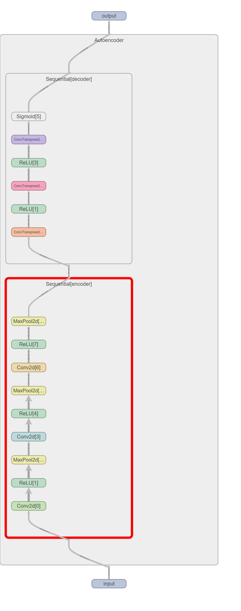
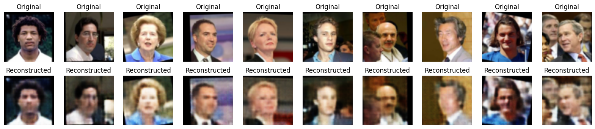

# 自編碼模型（Autoencoder）

自編碼模型（Autoencoder）是一種神經網絡，主要用於無監督學習。它的目的是學習數據的有效表示（通常稱為編碼），以便在無需標籤的情況下對數據進行有意義的特徵提取和降維。自編碼模型由兩個主要部分組成：編碼器和解碼器。

### 自編碼模型的基本結構

1. **編碼器（Encoder）**：
   - 編碼器將輸入數據映射到一個潛在空間（latent space），這個過程是通過一系列的線性或非線性轉換實現的。
   - 編碼器的輸出是潛在向量（latent vector），它是輸入數據的低維表示。

2. **潛在空間（Latent Space）**：
   - 潛在空間中的向量通常具有比原始輸入數據更少的維度，這有助於數據降維和特徵提取。
   - 潛在向量應該保留輸入數據的主要信息。

3. **解碼器（Decoder）**：
   - 解碼器從潛在空間重建輸入數據，它的結構通常與編碼器相反。
   - 解碼器的目的是生成與原始輸入數據相似的輸出。


### 訓練自編碼模型

自編碼器的訓練過程旨在最小化重建誤差，即使得重建數據與原始輸入數據之間的差異最小。常用的損失函數包括均方誤差（MSE）等。

### 自編碼模型的應用

1. **降維和特徵提取**：
   - 自編碼器可以用於數據降維和特徵提取，尤其在數據維度較高的情況下，如圖像數據和基因數據。

2. **數據去噪（Denoising）**：
   - 自編碼器可以用於去除數據中的噪聲，即“去噪自編碼器”（Denoising Autoencoder）。

3. **生成模型**：
   - 自編碼器也可以用於生成新數據，如變分自編碼器（Variational Autoencoder, VAE）能夠生成與訓練數據相似的新數據。

4. **異常檢測**：
   - 自編碼器可以用於異常檢測，因為異常數據的重建誤差通常較大。

### 變種自編碼器

- **稀疏自編碼器（Sparse Autoencoder）**：
  - 通過增加稀疏性約束，使得編碼器的輸出更具解釋性和判別性。

- **卷積自編碼器（Convolutional Autoencoder, CAE）**：
  - 專門用於處理圖像數據，利用卷積層進行特徵提取。

- **變分自編碼器（Variational Autoencoder, VAE）**：
  - 在潛在空間引入概率分佈，使得模型能夠生成新數據。


```python
import torch
import torchvision
import torchvision.transforms as transforms
from torch.utils.data import DataLoader
import matplotlib.pyplot as plt

# 定義數據預處理
transform = transforms.Compose([
    transforms.Resize((64, 64)),
    transforms.ToTensor(),
])

# 下載並加載LFW數據集
lfw_dataset = torchvision.datasets.LFWPeople(root='./data', split='train', transform=transform, download=True)
lfw_dataloader = DataLoader(lfw_dataset, batch_size=32, shuffle=True)

```

    Downloading http://vis-www.cs.umass.edu/lfw/lfw-funneled.tgz to ./data\lfw-py\lfw-funneled.tgz
    


      0%|          | 0/243346528 [00:00<?, ?it/s]


    Extracting ./data\lfw-py\lfw-funneled.tgz to ./data\lfw-py
    Downloading http://vis-www.cs.umass.edu/lfw/peopleDevTrain.txt to ./data\lfw-py\peopleDevTrain.txt
    


      0%|          | 0/66403 [00:00<?, ?it/s]


    Downloading http://vis-www.cs.umass.edu/lfw/lfw-names.txt to ./data\lfw-py\lfw-names.txt
    


      0%|          | 0/94727 [00:00<?, ?it/s]


```python
lfw_dataset
```


    Dataset LFWPeople
        Number of datapoints: 9525
        Root location: ./data\lfw-py
        Alignment: funneled
        Split: train
        Classes (identities): 5749
        StandardTransform
    Transform: Compose(
                   Resize(size=(64, 64), interpolation=bilinear, max_size=None, antialias=None)
                   ToTensor()
               )


```python
lfw_dataset[0][0].shape
```


    torch.Size([3, 64, 64])


```python
import torch.nn as nn
import torch.nn.functional as F

class Autoencoder(nn.Module):
    def __init__(self):
        super(Autoencoder, self).__init__()
        # 編碼器
        self.encoder = nn.Sequential(
            nn.Conv2d(3, 32, 3, stride=1, padding=1),
            nn.ReLU(),
            nn.MaxPool2d(2, stride=2),
            nn.Conv2d(32, 64, 3, stride=1, padding=1),
            nn.ReLU(),
            nn.MaxPool2d(2, stride=2),
            nn.Conv2d(64, 128, 3, stride=1, padding=1),
            nn.ReLU(),
            nn.MaxPool2d(2, stride=2),
        )
        # 解碼器
        self.decoder = nn.Sequential(
            nn.ConvTranspose2d(128, 64, 3, stride=2, padding=1, output_padding=1),
            nn.ReLU(),
            nn.ConvTranspose2d(64, 32, 3, stride=2, padding=1, output_padding=1),
            nn.ReLU(),
            nn.ConvTranspose2d(32, 3, 3, stride=2, padding=1, output_padding=1),
            nn.Sigmoid(),
        )

    def forward(self, x):
        x = self.encoder(x)
        x = self.decoder(x)
        return x

    def get_encoded_output(self, x):
        return self.encoder(x)

# 創建模型實例
model = Autoencoder()
criterion = nn.BCELoss()
optimizer = torch.optim.Adam(model.parameters(), lr=0.001)

```


```python
# 檢查是否有可用的GPU
device = torch.device("cuda" if torch.cuda.is_available() else "cpu")
model.to(device)

num_epochs = 10
for epoch in range(num_epochs):
    for data in lfw_dataloader:
        img, _ = data
        img = img.to(device)
        
        # 前向傳播
        output = model(img)
        loss = criterion(output, img)
        
        # 反向傳播
        optimizer.zero_grad()
        loss.backward()
        optimizer.step()
        
    print(f'Epoch [{epoch+1}/{num_epochs}], Loss: {loss.item():.4f}')

print('訓練完成')

```

    Epoch [1/10], Loss: 0.5098
    Epoch [2/10], Loss: 0.5096
    Epoch [3/10], Loss: 0.5054
    Epoch [4/10], Loss: 0.4951
    Epoch [5/10], Loss: 0.5003
    Epoch [6/10], Loss: 0.4864
    Epoch [7/10], Loss: 0.4674
    Epoch [8/10], Loss: 0.4790
    Epoch [9/10], Loss: 0.4736
    Epoch [10/10], Loss: 0.4888
    訓練完成
    


```python
from torch.utils.tensorboard import SummaryWriter

# 創建模型實例並移動到設備
model = Autoencoder().to(device)

# 初始化 SummaryWriter
writer = SummaryWriter()

# 創建一個隨機輸入，維度為 [batch_size, channels, height, width]
t_input = torch.randn(1, 3, 64, 64).to(device)  # 批量大小為1，通道數為3，高度和寬度為64

# 添加模型圖到 TensorBoard
writer.add_graph(model, t_input)
writer.close()

```




```python
import numpy as np


# 從數據集中取一組樣本
dataiter = iter(lfw_dataloader)
images, _ = dataiter.next()
images = images.to(device)
outputs = model(images)

# 轉移回CPU以進行可視化
images = images.cpu().detach().numpy()
outputs = outputs.cpu().detach().numpy()

# 可視化原始圖像和重建圖像
n = 10
plt.figure(figsize=(20, 4))
for i in range(n):
    # 展示原始圖像
    ax = plt.subplot(2, n, i + 1)
    plt.imshow(np.transpose(images[i], (1, 2, 0)))
    plt.title("Original")
    plt.axis("off")
    
    # 展示重建圖像
    ax = plt.subplot(2, n, i + 1 + n)
    plt.imshow(np.transpose(outputs[i], (1, 2, 0)))
    plt.title("Reconstructed")
    plt.axis("off")
plt.show()

```


    

    


```python

```
